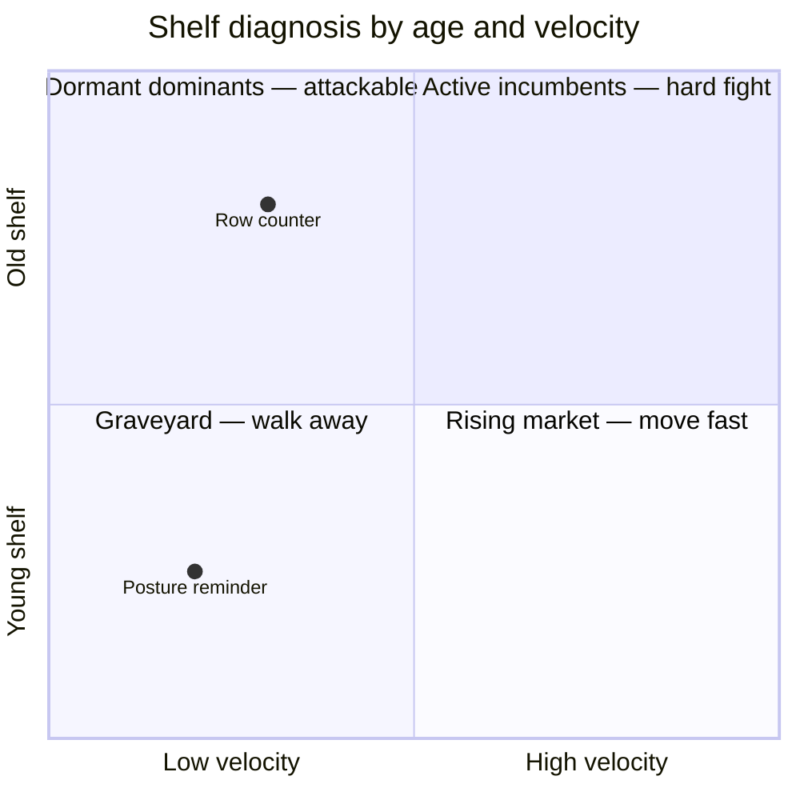
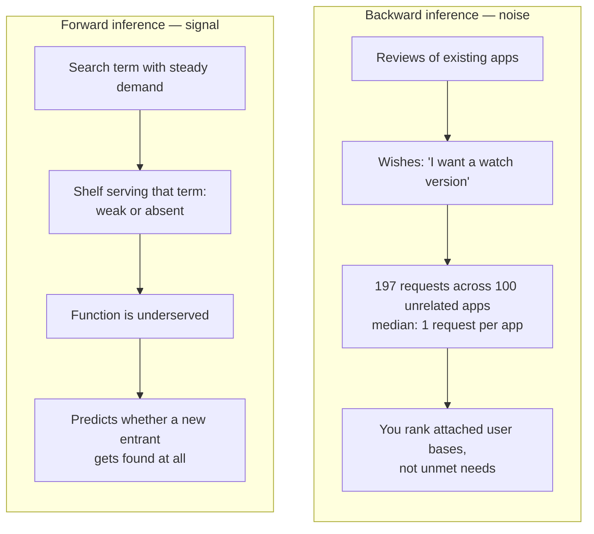
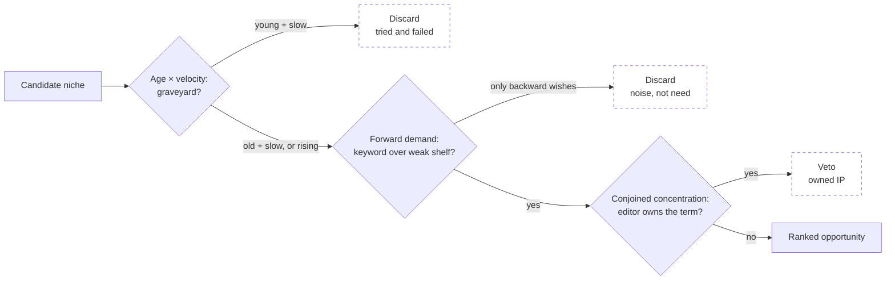

The best opportunity in my dataset was a trap.

I had built an automated pipeline that scans app stores looking for underserved niches. It scored candidates, ranked them, and put one niche at the very top: "posture reminder." Low competition. Weak incumbents. A shelf begging for a new entrant. Rank 1 out of 40.

Except it wasn't an opening. It was a graveyard. Six apps had entered that niche recently. None of them got traction. The pipeline was pointing at the exact spot where six predecessors had already failed — and calling it the best opportunity on the market.

That's the moment you realize your scoring model isn't wrong on the details. It's wrong on the question.

## The belief everyone shares

Everyone ranks niches the same way. Downloads. Review counts. Star ratings. Sort descending, or ascending, depending on whether you're hunting whales or gaps. It feels rigorous because the numbers are real.

Here's the problem. Downloads describe **products**. Review counts describe **products**. But a builder scanning a market isn't buying a product. A builder is asking a question about a **shelf**: is there room on it, who owns it, and which way does demand flow through it?

Product metrics can't answer that. Two shelves with identical numbers can be opposite realities. I know, because I measured it. Three times, three different ways. Each time, a structural signal — computed from the same public store data, no external APIs — beat the raw metric it replaced.

Let me show you the numbers.

## Signal 1 — the same review count, two opposite markets

Take two niches with the **same median review count**. Low in both cases. Raw metrics say: same opportunity. The truth is they are opposites, and one single metric separates them: **launch velocity** — reviews per year since release.

- **Old and slow**: 8.1 years of shelf age, 83 reviews/year. The incumbents captured the niche, then stopped developing. Dormant dominants. Attackable.
- **Young and slow**: 1.4 years, 7 reviews/year. Six recent apps entered. None got traction. Same low review count as the first case — but this shelf isn't underserved. It's a graveyard.

Same input number. Opposite verdicts. The disambiguator isn't *how many* reviews — it's *how fast, over how long*.

I ran this across 40 real niches. Introducing velocity moved "posture reminder" from **rank 1 to rank 36**. Think about what that means. Without this one signal, the pipeline's single most confident recommendation sends a builder into the one category where six teams already died. A false positive at rank 12 costs you a bad afternoon. A false positive at rank 1 costs you the product you actually build.

Consequence: never rank opportunities by raw counts alone. Pair every count with temporal depth. The shelf has a history, and the history is the signal.

## Signal 2 — you're inferring in the wrong direction

Here's a pattern almost every discovery pipeline uses, including mine at first. You scrape reviews of existing apps and look for wishes: *"users of app X keep asking for a watch version — so there's a watch niche."* It feels like listening to the market. It's actually listening to noise.

I scanned this signal at scale. Result: **197 documented requests, spread across 100 unrelated apps**. Median: **one request per app**. One. Each of those requests is a single person's comment, attached to a single product's user base. When you rank opportunities by these, you're not measuring unmet needs. You're measuring which apps happen to have attached user bases loud enough to leave comments.

The inference that works runs the other way: *"this search term attracts steady demand, and the shelf currently serving it is weak or absent — therefore the function is underserved."* That signal lives in keyword popularity crossed with shelf saturation. Market level. Not product level.

The two directions answer different questions. Backward inference answers: *what do users of product X complain about?* Forward inference answers: *will anyone find a new entrant on this shelf?* Only the second one is the builder's question. 197 opinions scattered across 100 products is noise. One strong keyword over a weak shelf is actionable.

Consequence: invert your inference direction. Measure demand where the market lives — in search — not where the products live.

## Signal 3 — some perfect scores are someone's property

The third failure mode is the cruelest, because it survives the first two filters. A niche scores perfectly — right age, right velocity, real search demand, weak shelf — and it is still unbuildable. The term is someone's intellectual property.

You'd think detecting that requires a trademark registry. It doesn't. It turns out the store data already contains the answer, in a pattern I'd call **conjoined concentration**: one editor controls ~100% of the niche's review volume, *and* that editor's name matches the niche term itself.

Tested on 16 real niches:

| Pattern observed on the shelf | Reading | Verdict |
|---|---|---|
| One editor = 100% of reviews, name matches the term ("Calm" → Calm) | Owned IP | Do not build |
| Leader at 64% of volume, 20 other editors on the shelf, no name match ("row counter") | Competitive niche | Buildable |

Concentration alone isn't enough — a competitive niche can still have a 64% leader. The name match alone isn't enough either. It's the conjunction that flags ownership: total dominance *plus* the editor literally being the term.

The heuristic classified **14 of 16** cases correctly. The two misses share a known blind spot: licensed IP. A franchise published by a third-party studio — Harry Potter shipped by Jam City, not by the rights holder — escapes the name-match test, because the editor's name and the term diverge even though the term is very much owned.

And here's what makes this signal different from the other two: it's not a ranking adjustment. It's a **veto**. Cost of the check: zero — it reuses data the scan already collected. Payoff: binary. Buildable, or not. It kills a niche before a single hour is spent on it.

## Three signals, one pipeline

Put together, the three signals don't polish the score. They restructure the question, in order:

Notice what's absent from that flowchart: downloads. Review counts. Star ratings. They still exist in the pipeline — as tie-breakers, at the very end, between candidates that already passed the structural gates. That's their real job. They were never fit to lead.

## What this says about measurement

Zoom out for a second, because this isn't really about app stores.

Every market gets measured by whatever is easiest to count. Downloads are easy to count. Reviews are easy to count. So they become the ranking, and the ranking becomes the strategy, and nobody notices that the thing being counted answers a different question than the one being asked. My pipeline produced confident nonsense not because its data was bad — the data was fine — but because raw metrics describe the objects *on* the shelf, while every question that matters is about the shelf itself. Its temporal depth. The direction demand flows through it. Who owns it.

The fix wasn't more data. All three signals came from the same public store data the pipeline already had. The fix was asking the data a structural question instead of a volumetric one.

So the next time a ranking hands you a confident number one — ask what the metric actually describes. If it describes the products, someone else's history is hiding in plain sight right behind it. Sometimes that history is eight quiet years of a dormant dominant. Sometimes it's six graves.

The shelf remembers. Raw metrics don't.
