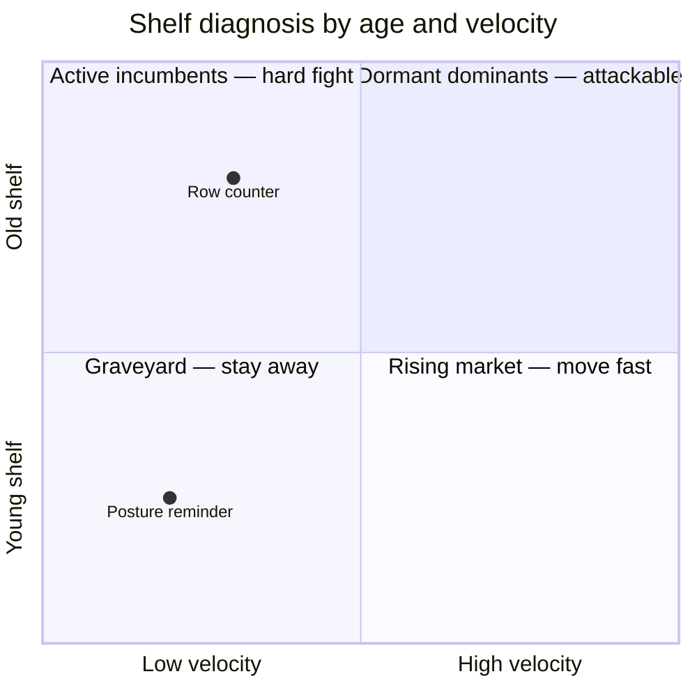

While building an automated pipeline that scans app stores for underserved
niches, the scoring model kept producing confident nonsense — until three
structural signals replaced the raw metrics. All three are measurable from
public store data alone, no external APIs. Here they are, with the numbers that
validated them.

## Signal 1 — age × velocity, not review counts

Two niches can show the **same median review count** and represent opposite
opportunities. The disambiguating metric is **launch velocity**: reviews per
year since release.

- **Old + slow** (8.1 years, 83 reviews/year): the incumbents captured the niche,
  then stopped developing. Dormant dominants — attackable.
- **Young + slow** (1.4 years, 7 reviews/year): six recent apps entered, none got
  traction. Same low review count as the first case — but it's a graveyard, not
  an opening.

Measured across 40 real niches, introducing velocity moved "posture reminder"
from **rank 1 to rank 36**. A single false positive at the top of that ranking
sends a builder into a category where six predecessors already failed.

## Signal 2 — invert the inference direction

Most discovery pipelines reason backwards: *"users of app X ask for a watch
version → there's a watch niche."* Scanned at scale, that signal turned out to
be noise: **197 documented requests spread across 100 unrelated apps** — a
median of one request per app. Each is one person's comment, attached to one
product's user base.

The forward inference works: *"this search term attracts steady demand, and the
current shelf serving it is weak or absent → the function is underserved."*
That signal lives in keyword popularity crossed with shelf saturation — at the
**market** level, not the **product** level. The two directions answer different
questions, and only one of them predicts whether a new entrant gets found.

## Signal 3 — editor concentration reveals trademarks

Some niches score perfectly and are still unbuildable: the term is someone's
intellectual property. It turns out you can detect this from store data alone,
without consulting a trademark registry. The pattern is **conjoined
concentration**: one editor controls ~100% of the niche's review volume *and*
the editor's name matches the niche term.

Tested on 16 real niches:

| Pattern | Reading | Verdict |
|---|---|---|
| One editor = 100% of reviews, name matches term ("Calm") | Owned IP | Do not build |
| Leader at 64% of volume, 20 other editors present, no name match | Competitive niche | Buildable |

The heuristic classified **14 of 16** cases correctly. Known blind spot:
licensed IP (a franchise published by a third-party studio) escapes the
name-match test. Cost of the check: zero — it reuses data the scan already has.
Payoff: binary, it vetoes a niche before any effort is spent.

## What these three have in common

Raw metrics — downloads, review counts, star ratings — describe **products**.
All three signals above describe the **shelf**: its temporal depth, the
direction demand flows through it, who owns it. That's the actual question a
builder is asking. Rank by shelf structure first; use product metrics only to
break ties.
