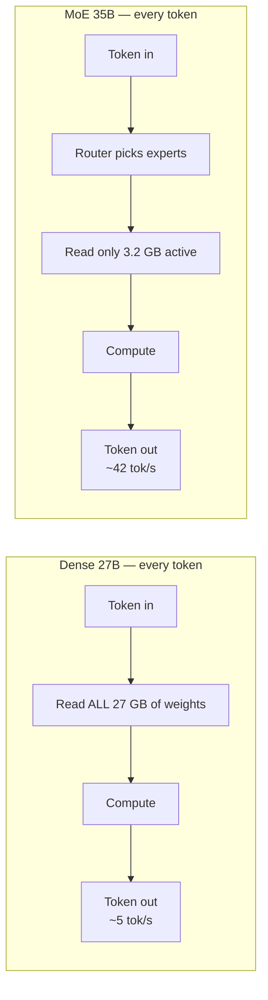
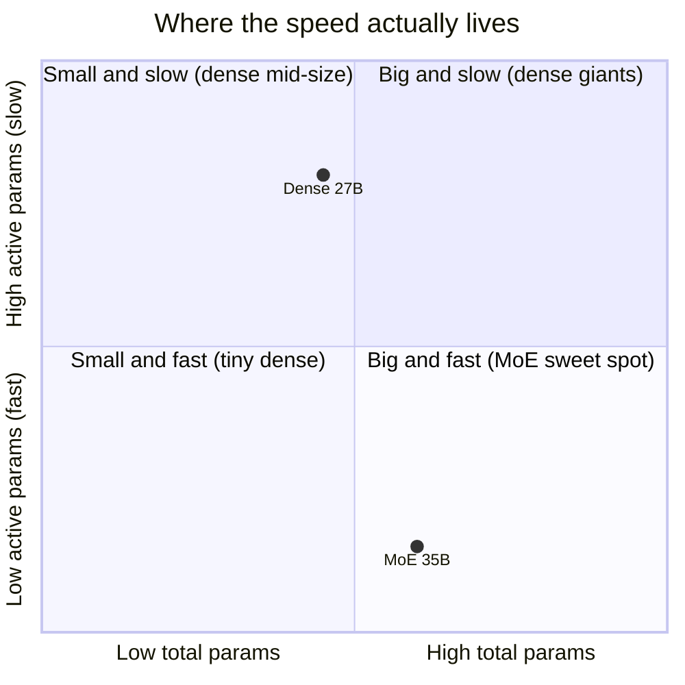
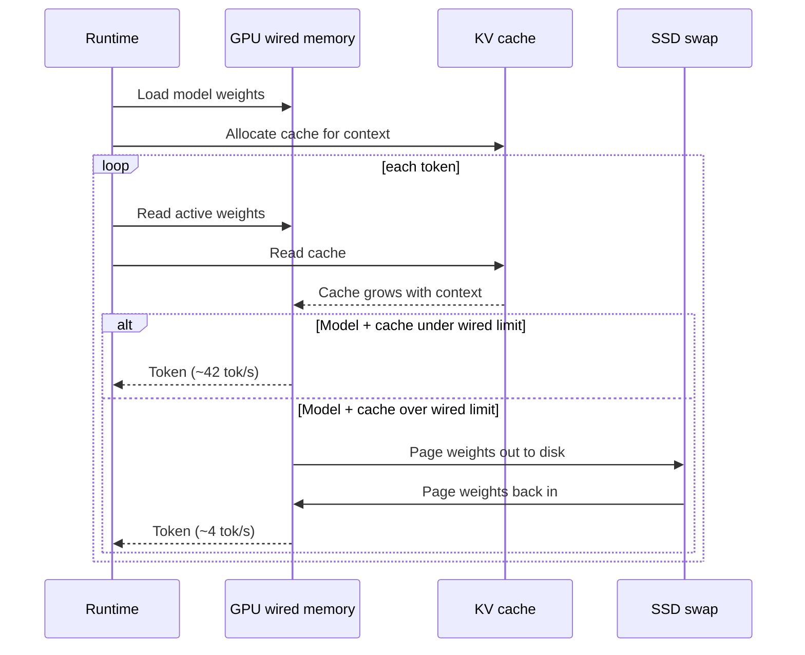
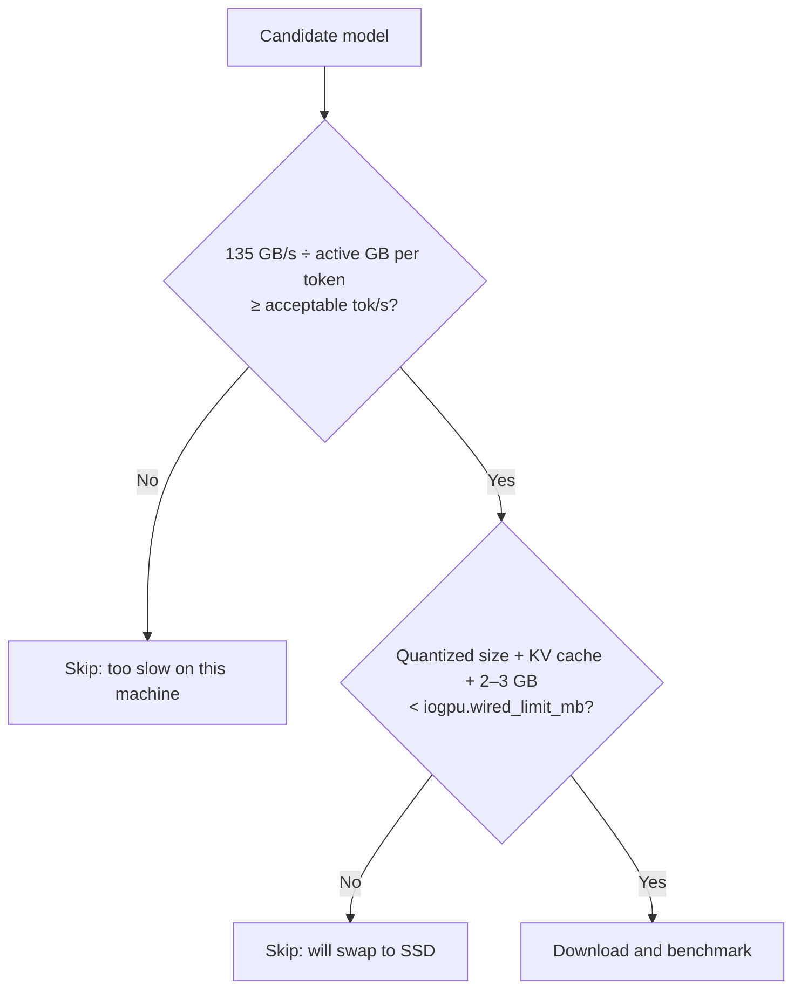

I downloaded a 27B model and got 5 tokens per second. Then I downloaded a 35B model and got 42.

Same Mac. Same 32 GB of RAM. Same evening. The bigger model was faster. Not a little faster. Eight times faster on paper, five times faster on my stopwatch.

Everyone thinks bigger equals slower. It is the most natural belief in the world: more parameters, more work, more waiting. And it is wrong. Or rather, it is measuring the wrong thing. Let me show you what I measured, and why I now pick models with a completely different question in mind.

## The belief: speed is about compute

Here is what I assumed for years. A model is a big pile of matrix multiplications. A bigger model means more multiplications. More multiplications means the GPU sweats longer. Therefore bigger is slower.

It sounds right. It is how every other program on your computer behaves.

But an LLM generating text is not a normal program. For every single token it produces, it has to read its weights. All of them. From memory. Again. And again. And the GPU on my M1 Pro is not the bottleneck. The pipe between memory and the GPU is.

I measured that pipe at about 135 GB/s of effective bandwidth. That number is the whole story.

## The mechanism: one formula

Once you accept that every token means re-reading the weights, speed becomes arithmetic:

```
tokens/sec = effective_bandwidth ÷ weights_read_per_token
```

Plug in my machine. A dense 27B model reads roughly 27 GB per token. 135 divided by 27 gives 5 tokens per second. That is exactly what I saw.

Now the 35B model. It is a mixture-of-experts. It stores 35B parameters, but for each token it routes the computation through only 3.2B of them. It reads about 3.2 GB per token. 135 divided by 3.2 gives 42 tokens per second.

Here is the per-token path, side by side.



The dense model is a library where you must re-read every book before saying a word. The MoE is a library with a librarian who hands you the three books you actually need. Different experts get activated for different tokens, so over a whole answer the model uses its 35B of knowledge. But per token, per read, it touches a fraction.

The consequence is brutal and simple: on my hardware, the model with 8B more parameters is an order of magnitude faster, because the denominator is what matters.

## Honest note: 8× on paper, 5× on the stopwatch

The formula predicted 8×. I measured roughly 5×. I want to be clear about that gap instead of hiding it.

The formula only counts weight reads. It ignores the attention computation, the KV cache reads that grow with context length, the router overhead in the MoE, and whatever the runtime does between tokens. All of those eat into the MoE's advantage more than the dense model's, because the MoE's weight read is so small that the other costs stop being negligible.

So the formula is not a precise predictor. It is a first-order estimate. But a first-order estimate that gets you within a factor of two, before you spend an hour downloading, is worth a lot more than a gut feeling that gets the direction wrong.

## Two levers on the same denominator

Quantization and mixture-of-experts feel like unrelated topics. Once you have the formula, they are the same move.

Quantization shrinks each weight. A 27B model in 4-bit takes about 16 GB instead of 27. The numerator does not change; the denominator drops.

MoE shrinks the number of weights read. Same denominator, different lever.

They stack. A quantized MoE is small per weight and small in weights-per-token. That is why the fastest models I can run locally are, counterintuitively, some of the largest by parameter count.

| Model | Total params | Active per token | Weight read per token | Predicted tok/s (135 GB/s) |
|---|---|---|---|---|
| Dense 27B | 27B | 27B | ~27 GB | ~5 |
| MoE 35B | 35B | 3.2B | ~3.2 GB | ~42 |

Look at the second and third columns. Total params tells you how much disk and RAM you need. Active params tells you how fast it will run. Two different questions. Most model cards make you hunt for the second one.



The bottom-right quadrant is where I want to live on constrained hardware. Big knowledge, small read. Push the logic further: a 100B MoE with 5% activation reads about the same per token as a 5B dense model, while carrying the world knowledge of something twenty times larger. On a single GPU, a Mac, an edge box, that is the trade you want.

## The second trap: 32 GB is not 32 GB

The formula got me excited. So I got greedy and tried a bigger model. A 29 GB one. I have 32 GB. Should fit.

It did not fit. Not "it was slow." It did not load.

Here is the memory budget on an Apple Silicon Mac, the one nobody prints on the box. macOS keeps about 4 GB for the kernel. Then there is a sysctl called `iogpu.wired_limit_mb`, and it defaults to 75% of unified memory for GPU use. On 32 GB, that is a ceiling around 24 GB. Realistically, the usable window for model plus cache is somewhere between 24 and 28 GB. And it is a hard stop, not a soft one.

| Budget line | Size on my 32 GB M1 Pro |
|---|---|
| Kernel reservation | ~4 GB |
| GPU wired limit (75% default) | ~24 GB ceiling |
| Dense 27B in 4-bit | ~16 GB |
| KV cache (grows with context) | variable, must fit under the ceiling |
| Safety margin I now keep | 2–3 GB |
| 29 GB model | does not fit, at all |

And crossing the line is worse than not loading. When model plus KV cache exceed the GPU limit, macOS does not politely refuse. It starts paging to the SSD.



I watched this happen. A model that was running at 42 tokens per second dropped to about 4 as the conversation got longer and the cache pushed it over the line. Ten times slower, and nothing in the log told me why. The formula still held. The effective bandwidth had just become SSD bandwidth.

The consequence: the ceiling is not a spec sheet number. It is `iogpu.wired_limit_mb`, minus the model, minus the cache at the longest context you will actually use, minus a margin.

## Trade-offs I am not pretending away

MoE models are not free. They take more disk and more RAM than their speed suggests, because you store all 35B even if you read 3.2B. On my Mac that is the exact resource I am short of. A dense 27B quantized to 16 GB leaves me room. A large MoE may not.

The router adds overhead, which is part of why 8× became 5×.

And the formula says nothing about quality. Active parameters predict speed, not intelligence. A fast wrong answer is still wrong. I benchmarked speed here because speed was what surprised me, not because it is the only thing that matters.

## What I would do differently

I would not download first and benchmark second. I would do the division first.

Before every download, three checks:

1. Bandwidth divided by weight footprint per token. If the answer is under 10 tokens per second, I will hate using it interactively. Skip it.
2. Model size in quantized form, plus KV cache at my real context length, against the wired GPU limit. Not against 32 GB. Against the actual sysctl value.
3. Two to three GB of margin on top. The swap cliff is not a gentle slope.



That flowchart would have saved me one wasted evening and one very confusing slowdown.

## Zoom out

What this changed for me is not a model preference. It is the question I ask of any hardware and any model.

We talk about models by their total parameter count because it is the number on the label. We talk about machines by their RAM because it is the number on the box. Both are storage numbers. Neither is a throughput number. And what you feel, sitting in front of the terminal waiting for the next word, is throughput.

The real questions are: how many bytes does this thing need to read per unit of work, and how many bytes per second can this machine actually deliver to the place doing the work? Everything else is packaging.

That reframing is older than LLMs. It is the same reason a database with a good index beats a bigger server with a full scan. Bigger is not slower. Reading more is slower. Once you see the difference, you cannot unsee it, and you start choosing everything, models, machines, architectures, by the size of the read instead of the size of the thing.
