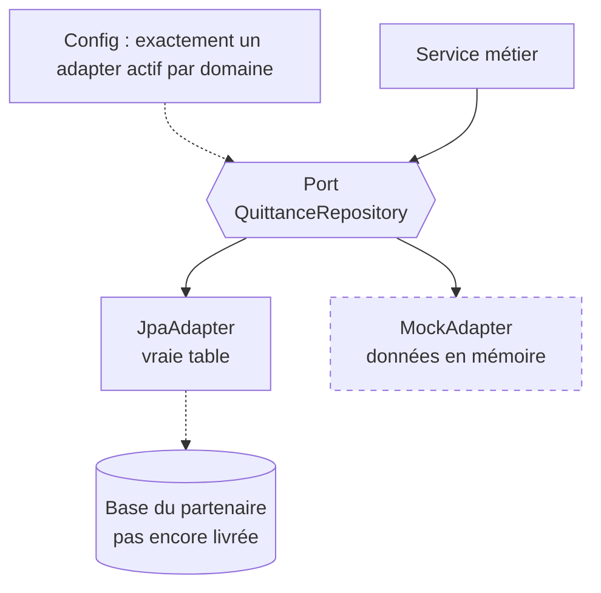
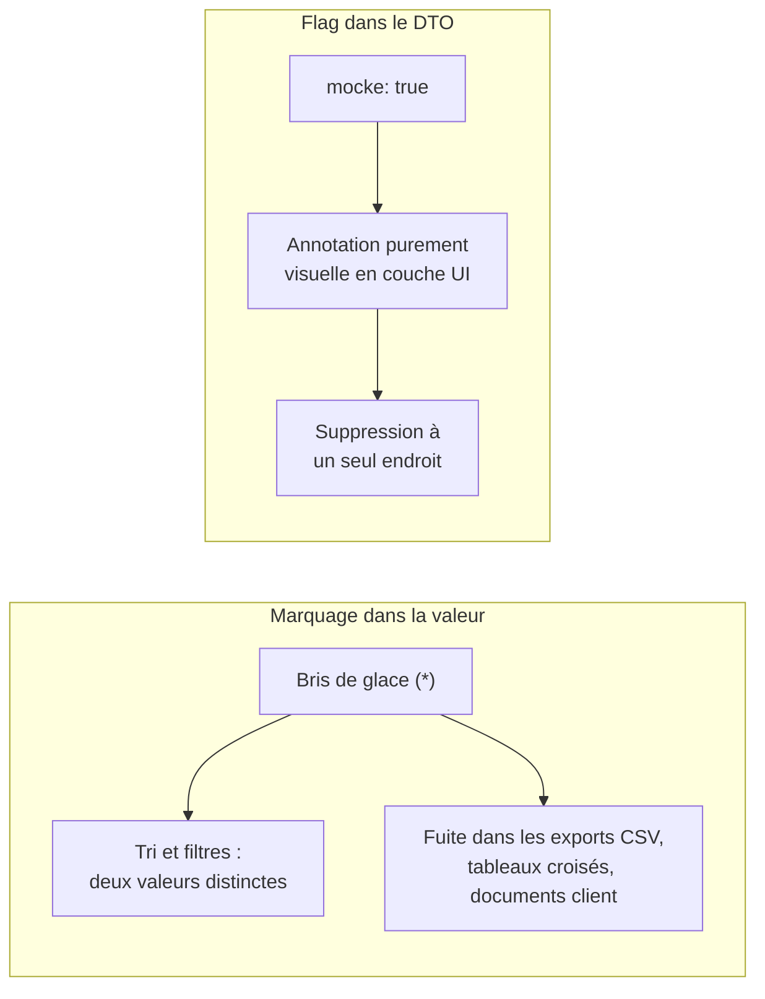
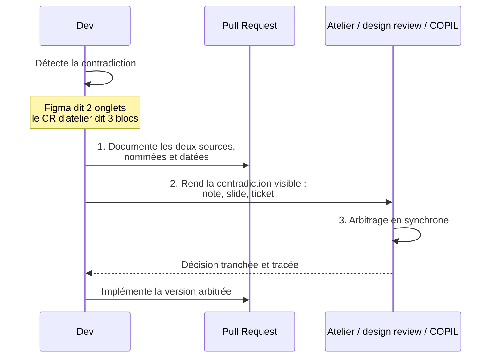

Le schéma de base de données du partenaire n'était pas livré. Le produit, lui, devait avancer. Projet d'intégration avec un assureur, quatre domaines de données, et un amont qui bouge encore : pas de tables, et deux documents de spec qui se contredisent.

Face à ça, vous avez deux réflexes possibles. Attendre — et vous ne livrez rien. Ou coder "en attendant" — et là, tout le monde connaît la recette : un feature flag, un `if (mockMode)`, promis on branchera la vraie donnée plus tard. Tout le monde fait ça.

Et c'est exactement comme ça qu'on fabrique de la dette avant même la v1.

Je vais vous montrer le dispositif qui a tenu sur ce projet réel. Trois techniques. Une seule idée derrière : rendre l'incertitude **explicite et localisée** au lieu de la laisser diffuser partout.

## Le feature flag n'est pas une solution, c'est un aveu

Réfléchissez à ce que fait vraiment un `if (mockMode)`. Il crée deux chemins d'exécution dans la **même** classe. Deux chemins qui vivent ensemble, se testent ensemble, se maintiennent ensemble. Et le jour où la vraie donnée arrive, l'un des deux meurt en production — sans jamais être nettoyé. Vous le savez. Moi aussi. Personne ne nettoie les flags morts.

L'alternative n'est pas nouvelle, mais presque personne ne l'applique quand il s'agit de données mockées : un port par domaine, deux adapters, un seul actif par configuration.

La différence avec le flag est structurelle, pas cosmétique. La couche service ne sait pas qui la sert. Elle parle à un port. Point. Le jour où le partenaire livre le vrai schéma : une ligne de configuration bascule, le `MockAdapter` part à la poubelle, le service n'a pas bougé d'une ligne. Pas de chemin mort. Pas de `TODO quand la table arrivera`.

La preuve vécue : quatre domaines sur ce projet — quittances, contrats, référentiels, piste d'audit. Chacun derrière son port, chacun avec son couple d'adapters. Et chacun a basculé vers le réel **indépendamment, à des dates différentes**, au rythme des livraisons du partenaire. Un flag global n'aurait jamais permis ça. Quatre flags auraient été quatre bombes à retardement.

Mais attention au piège — et il est vicieux. Un mock qui ne réplique pas les contraintes du réel est pire qu'inutile. Si la vraie table filtre par code agent, votre `MockAdapter` doit filtrer par code agent. Sinon vos tests valident un comportement qui n'existera jamais en production. Le mock devient un mensonge bien architecturé. Et un mensonge bien architecturé est plus dangereux qu'un hack visible : on lui fait confiance.

## L'astérisque qui fuit dans vos exports

Deuxième problème, plus sournois. Tant que mock et réel cohabitent à l'écran, l'utilisateur doit savoir ce qui est simulé. Il le doit. Une démo où personne ne distingue le vrai du faux, c'est une démo qui ment.

Le premier réflexe, on l'a tous eu : suffixer la valeur. `"Bris de glace (*)"`. C'est rapide, c'est visible, c'est fait.

C'est aussi une contamination de la donnée par une information d'infrastructure. Et ça se paie vite.

Concrètement, sur ce projet : les tableaux avec tri et filtre séparaient `Bris de glace` et `Bris de glace (*)` en deux valeurs distinctes. Deux lignes dans un regroupement au lieu d'une. Et l'astérisque fuyait partout où la donnée voyage — exports CSV, tableaux croisés, documents destinés au client. Une marque de simulation dans un document client. Relisez cette phrase.

La solution tient en un booléen : `mocke: true` dans le DTO. La valeur reste propre. Le marquage devient une annotation purement visuelle, rendue par la couche UI et par elle seule. Quand la vraie table arrive, vous supprimez le rendu du marqueur **à un seul endroit** — pas une chasse aux astérisques dans toute la base.

Vous voyez le motif ? C'est le même principe que le port/adapter, appliqué à la donnée. La *simulation* est une information d'infrastructure. Elle ne contamine ni le métier, ni la valeur. Elle vit à côté, étiquetée, prête à disparaître.

## Deux specs se contredisent : le silence est le vrai risque

Un amont instable, ce n'est pas que des tables manquantes. C'est aussi des documents qui divergent. Sur ce projet : la maquette Figma montre 2 onglets. Le compte-rendu d'atelier d'il y a deux jours en demande 3 blocs. Les deux sources sont officielles. Les deux sont récentes.

Le réflexe du bon élève : trancher soi-même, "logiquement", et avancer. C'est le pire choix possible. Pas parce que votre logique est mauvaise — elle est peut-être excellente. Mais parce que choisir seul garantit qu'une moitié des parties prenantes sera surprise plus tard. Et la surprise d'un stakeholder, ça se paie en confiance sur tout le reste du projet.

Le protocole qui a marché tient en trois mouvements :

Un : **documenter les deux sources**, nommées et datées, dans la PR et dans le code. Pas "la maquette dit autre chose" — quelle maquette, quelle date, quel compte-rendu. Deux : **rendre la contradiction visible** — une note, une slide, un ticket. Pas un commentaire enfoui que personne ne lira. Trois : **router la décision vers l'instance synchrone** où l'arbitrage est vivant : atelier, design review, COPIL. Là où les gens qui portent les deux versions sont dans la même pièce.

Notez ce que ce protocole ne fait pas : il ne bloque pas le développement. Vous continuez à coder — derrière un port, avec des données marquées, justement. Il ne fait qu'empêcher une décision implicite de se déguiser en décision prise.

## Décider où habite l'incertitude

Prenez du recul sur les trois techniques. Un adapter mock dit "ceci est provisoire". Un flag `mocke` dit "ceci est simulé". Une contradiction documentée dit "ceci n'est pas tranché". Trois phrases différentes, un seul geste : donner à l'incertitude un nom, une frontière, et une date de sortie.

C'est là que la plupart des projets se trompent. On croit que gérer un projet, c'est éliminer l'incertitude — attendre que le partenaire livre, attendre que les specs convergent, attendre d'être sûr. Mais l'incertitude d'un amont instable ne se négocie pas. Elle existe. La seule vraie décision, c'est **où elle habite** : diffuse dans le code sous forme de flags, d'astérisques et d'arbitrages silencieux — ou localisée dans des adapters jetables, des booléens de DTO et des tickets d'arbitrage.

Diffuse, elle devient de la dette que personne n'a choisie. Localisée, elle devient un plan : chaque zone incertaine a un propriétaire, un mécanisme de bascule, et un jour où elle disparaît proprement.

Le projet avance. Le partenaire livre quand il livre. Et personne — ni dev, ni utilisateur, ni stakeholder — ne découvre l'incertitude par accident. C'est tout ce qu'on peut demander à une architecture quand l'amont n'est pas stabilisé. Et c'est déjà beaucoup.
