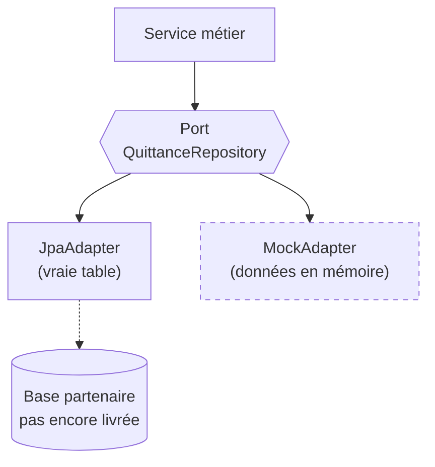

Situation classique en projet d'intégration : le produit doit avancer, mais le
schéma de base de données du partenaire n'est pas livré, et deux documents de
spec se contredisent. Attendre n'est pas une option ; coder "en dur" en attendant
non plus — c'est comme ça qu'on fabrique de la dette avant même la v1. Voici le
dispositif qui a tenu sur un projet réel, quatre domaines de données, amont
instable.

## Deux implémentations derrière un port, zéro feature flag

Le réflexe courant : truffer le code de `if (mockMode)`. Le problème n'est pas
esthétique — chaque flag crée deux chemins d'exécution dans la **même** classe,
dont un mourra en production sans jamais être nettoyé.

L'alternative : un port par domaine, deux adapters, un seul actif par
configuration.

La couche service ne sait pas qui la sert. Le jour où le partenaire livre le
vrai schéma : une ligne de configuration bascule, l'adapter mock part à la
poubelle, le service n'a pas bougé. Testé sur quatre domaines (quittances,
contrats, référentiels, piste d'audit) — chacun a basculé indépendamment, à des
dates différentes.

**Le piège** : un mock qui ne réplique pas les contraintes du réel. Si la vraie
table filtre par code agent, le MockAdapter doit filtrer par code agent. Sinon
vos tests valident un comportement qui n'existera jamais en production — le mock
devient un mensonge bien architecturé.

## La donnée mockée se marque par un flag, jamais dans la valeur

Tant que mock et réel cohabitent à l'écran, l'utilisateur doit savoir ce qui est
simulé. Premier réflexe : suffixer la valeur — `"Bris de glace (*)"`. Mauvaise
idée, et elle se paie vite :

- le tri et les filtres du tableau séparent `Bris de glace` et
  `Bris de glace (*)` en deux valeurs distinctes ;
- l'astérisque fuit dans les exports CSV, les tableaux croisés, les documents
  client.

La donnée reste propre : un booléen `mocke: true` dans le DTO, et le marquage
devient une **annotation purement visuelle** dans la couche UI. Quand la vraie
table arrive, on supprime le rendu du marqueur à un seul endroit — pas une chasse
aux astérisques dans toute la base.

C'est le même principe que le port/adapter, appliqué à la donnée : la
*simulation* est une information d'infrastructure, elle ne contamine ni le
métier ni la valeur.

## Deux specs se contredisent : on n'arbitre pas en silence

Amont instable, c'est aussi des documents qui divergent : la maquette Figma
montre 2 onglets, le compte-rendu d'atelier d'il y a deux jours en demande 3.
Choisir seul, même "logiquement", garantit qu'une moitié des parties prenantes
sera surprise plus tard — et que la confiance se paiera sur le reste du projet.

Le protocole qui marche :

1. **Documenter les deux sources**, nommées et datées, dans la PR et le code ;
2. **Rendre la contradiction visible** — une note, une slide, un ticket, pas un
   commentaire enfoui ;
3. **Router la décision vers l'instance synchrone** où l'arbitrage est vivant :
   atelier, design review, COPIL.

Le point commun avec les deux techniques précédentes : rendre l'incertitude
**explicite et localisée** au lieu de la laisser diffuser dans le code. Un
adapter mock dit "ceci est provisoire" ; un flag `mocke` dit "ceci est simulé" ;
une contradiction documentée dit "ceci n'est pas tranché". Le projet avance, et
personne ne découvre l'incertitude par accident.
