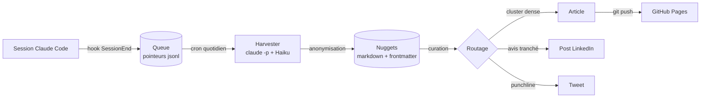

Ce site n'est pas écrit à la main. Chaque article part d'insights extraits de vraies
sessions de travail avec Claude Code, anonymisés, puis distillés. Voici le mécanisme,
entièrement git-based.

## Le principe

Trois étages, découplés. La capture est gratuite et instantanée ; l'extraction (qui
coûte des tokens) est différée en batch quotidien ; la rédaction n'a lieu que quand
la matière le justifie.

## Pourquoi différer l'extraction

Un hook qui appelle un LLM à chaque fin de session serait lent et coûteux — et la
plupart des sessions ne contiennent rien de publiable. Le hook se contente donc
d'empiler un pointeur (chemin du transcript, projet, timestamp) dans un fichier
JSONL. Coût : zéro. Le harvester passe une fois par jour, filtre les sessions trop
courtes, et un modèle économique extrait 0 à 4 nuggets par session — zéro étant un
résultat parfaitement acceptable.

## La confidentialité comme contrainte de design

Les sessions touchent du travail client. Deux passes de rédaction : le prompt
d'extraction impose des alias (« un produit insurtech » plutôt que le nom), puis une
passe mécanique regex intercepte secrets, chemins et emails. Ce qui reste douteux
part dans une file `_review/` et n'atteint jamais la publication sans validation
humaine.

## Le routage éditorial

| Signal détecté | Format de sortie |
|---|---|
| ≥ 3 nuggets liés, densité forte, matière à schéma | Article (comme celui-ci) |
| 1-2 nuggets, opinion défendable | Post LinkedIn, direct, sans diplomatie |
| 1 nugget punchy | Tweet — parfois en darija |

Le tout tient dans un repo : pas de base de données, pas de backend, pas de SaaS.
`git log` est l'historique éditorial, une PR est un comité de relecture, et GitHub
Pages est l'imprimerie.
