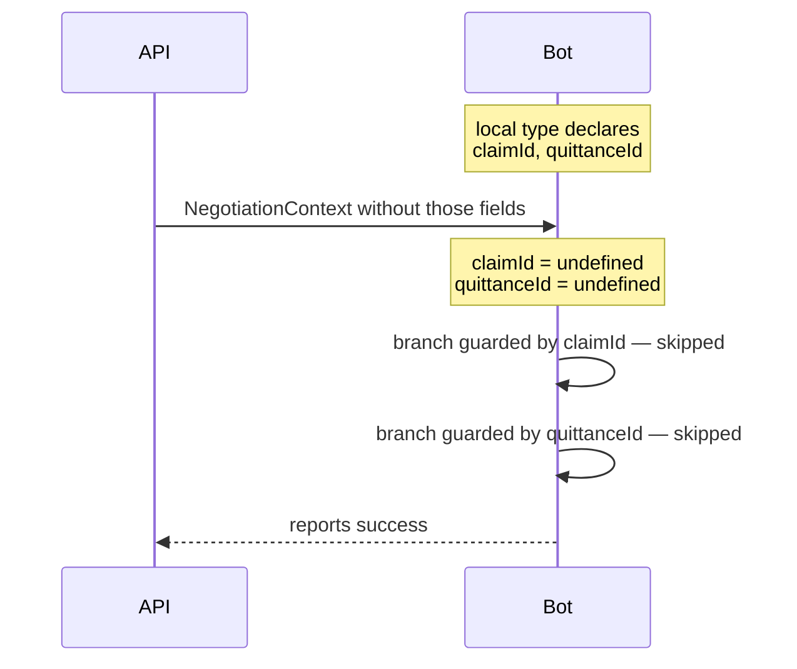
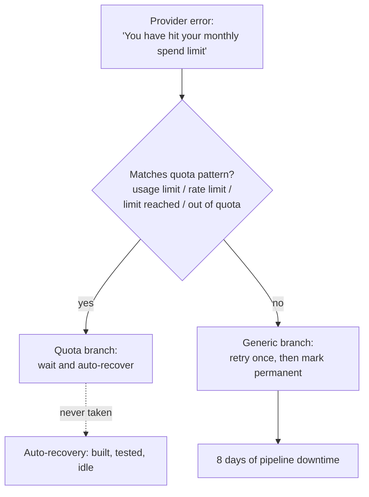
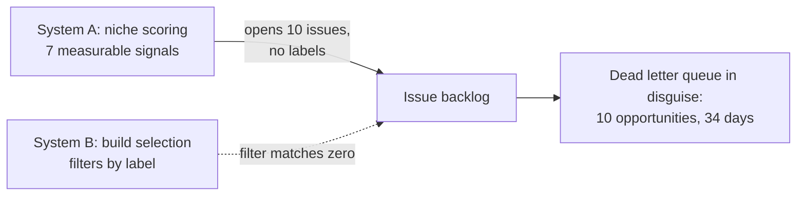

Everyone is afraid of the crash. The exception in the middle of the night, the pager alert, the red dashboard. We build entire toolchains around preventing it.

I've stopped fearing crashes. I've started fearing their absence.

Because over a few months of building distributed systems — an insurtech platform, an automated app factory — the incidents that cost the most never threw a single exception. A crash is a gift. It comes with a stack trace, a timestamp, an alert. Someone gets paged. Someone fixes it.

The expensive failures were the ones where **everything kept running**. Four incidents. Four different systems. Same signature. Let me show you.

## The compiler lied to both of us

You trust your type checker. I did too. Here's what that trust is actually worth across a service boundary: nothing.

A bot service and an API exchanged a `NegotiationContext` object. The bot's codebase typed it locally, with fields `claimId` and `quittanceId`. The API never sent those fields. And TypeScript compiled both projects without a single warning — because each one was *internally* consistent. Two green builds. Two happy repos. One broken contract.

At runtime, both fields were `undefined`. Two branches of bot logic never executed. No exception. No log line. The bot simply did *less than designed*, and from the outside it looked identical to a bot doing its job. Finding the root cause meant tracing the actual API response by hand to spot the gap.

Here's the belief to kill: "it type-checks, so the contract holds." When two services each hand-type a shared DTO, the contract is **unverified**. The type checker gives you confidence within each repo and none between them. The safety is illusory — and an illusory safety is worse than no safety, because you stop looking.

The fix is boring and non-negotiable: OpenAPI with runtime validation, or a generated client shared by both sides. Never hand-typed DTOs across a service boundary. And log the skip path explicitly — divergence should show up in your logs, not in hidden control flow.

## "Connected" is not "stable"

Second incident, same platform. A third-party connection reported `status: open` for weeks. It was also reconnecting **eight times a day** and emitting 503 bursts in between.

Was the status check lying? No. That's the uncomfortable part. The boolean answered the question "are you connected *right now*?" — and at almost any instant you sampled it, the answer was honestly yes. The connection dropped, reconnected within moments, and the snapshot went back to green.

The real signal was never in the snapshot. It was in the **trend**: reconnection frequency drifting upward over weeks. "Connected" and "stable" are orthogonal properties, and a point-in-time boolean can only ever see the first one. This is the difference between knowing a system is broken and knowing it has been *degrading silently for weeks*.

Anything that reconnects, retries, heartbeats or polls has a frequency. That frequency is the health signal. The boolean is decoration.

## One word. Eight days.

Now the automated app factory. An automated pipeline classified provider errors to decide whether to retry. The pattern matched `usage limit | rate limit | limit reached | out of quota`. Reasonable, right? Covers the cases everyone has seen.

The provider's actual message was: *"You've hit your monthly **spend** limit."*

One word missing from a regex. The generic branch treated the error as retry-once-then-permanent. The auto-recovery mechanism existed, was tested, and **never fired**. Eight days of downtime — while every single component behaved exactly as written. Read that again: nothing malfunctioned. The system executed its specification perfectly. The specification had a one-word hole.

The deeper lesson: vendor error strings are ephemeral. Every provider phrases quotas differently, and per-provider regex patterns rot under API churn. Classify the **semantic intent** — cost, quota, exhaustion — with a broad fallback. And, crucially, log every classification miss as its own event. The regex failing was survivable. The regex failing *silently* was not.

## Two systems that never spoke

Last one, and my favorite, because both systems were *right*.

One system scored market niches on seven measurable signals and opened issues for the winners. A second system scored concept feasibility and selected issues to build — filtering by labels the first system never set. Neither was wrong. Neither errored. Each one, judged alone, was doing excellent work.

For **34 days**, ten qualified opportunities sat in what was effectively a dead letter queue. Every dashboard on system A said "productive": issues created, scores computed. Every dashboard on system B said "healthy": selection running, no errors. The pipeline throughput was zero.

The repair was a one-line label fix. One line, thirty-four days. The lesson scales far beyond labels: a measurement system is only complete when its output is **consumed**. A score that routes to the void is worse than no score at all — it looks productive on every dashboard while doing nothing. If nobody measures the handoff, the handoff doesn't exist.

## The common signature

Four incidents, two very different systems, and every time the same shape: something we trusted kept telling us "fine" while the outcome quietly went to zero.

| Incident | What kept lying | What would have told the truth |
|---|---|---|
| DTO divergence | The compiler | Runtime contract validation |
| `status: open` | The snapshot boolean | Reconnection-rate trend |
| Quota regex | The "no error" logs | Logging classification misses |
| Unlinked scoring | Per-system dashboards | End-to-end throughput metric |

Name the pattern: in each case we monitored a **proxy for health** — compiles, connected, no exception, issues created — instead of the **outcome**: branch executed, stream stable, quota handled, opportunity built. Proxies fail silent. Outcomes can't.

Three habits would have caught all four:

1. **Log the skip path, not just the error path.** `if (x)` deserves an `else` that warns when `x` is supposed to exist. The DTO incident would have been one log line instead of a manual trace.
2. **Monitor rates and trends, not booleans.** Anything that reconnects, retries or polls has a frequency — alert on its drift, not its instant value.
3. **Measure the pipeline end-to-end.** If system A produces for system B, the metric that matters is *items consumed by B*. Items produced by A is vanity.

## The zoom-out

Here's what these four incidents taught me about systems in general: a system never tells you it's failing. It tells you what you asked it to tell you. And by default, we only ask about the loud failure modes — the exception, the timeout, the 500 — because those are the ones that hurt us early in our careers.

But a distributed system has far more ways to *do less than designed* than to crash. Skipped branches. Degrading streams. Unmatched classifiers. Orphaned outputs. None of these throw. All of them compound. And the longer they run, the more the green dashboards convince you nothing is wrong — eight days here, thirty-four days there.

So the real discipline of observability isn't collecting more signals about what your system does. It's instrumenting what your system was *supposed* to do and didn't. The skip, the miss, the drift, the void.

Silence is not a health signal. It's the absence of one.
