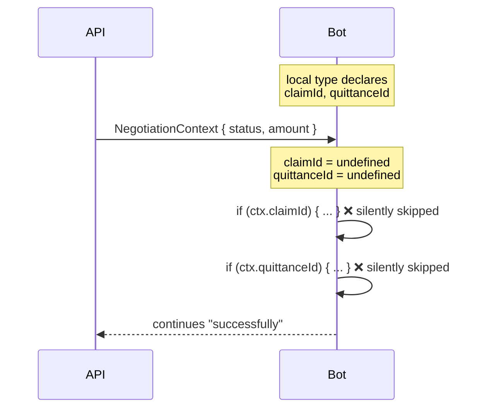

Over a few months of building distributed systems — an insurtech platform, an
automated app factory — the incidents that cost the most were never the ones that
crashed. A crash is a gift: it has a stack trace, a timestamp, a pager alert.
The expensive failures were the ones where **everything kept running**.

Here are four of them, and the single lesson they share.

## Incident 1 — the DTO that compiled

A bot service and an API exchanged a `NegotiationContext` object. The bot's
codebase typed it locally with fields `claimId` and `quittanceId`. The API never
sent those fields. TypeScript compiled both projects without a warning — each one
was internally consistent.

At runtime, both fields were `undefined`. Two branches of bot logic never
executed. No exception, no log line — the bot simply did less than designed, and
nobody could tell from the outside.

When two services each hand-type a shared DTO, the contract is **unverified**.
The type checker gives you confidence within each repo and none between them.
Fix: OpenAPI with runtime validation, or a generated client shared by both sides.
Never hand-typed DTOs across a service boundary.

## Incident 2 — `status: open`

A third-party connection reported `status: open` for weeks. It was also
reconnecting **eight times a day** and emitting 503 bursts in between.

The boolean answered the question "are you connected *right now*?" — and at
almost any instant, the answer was honestly yes. The real signal was the
**trend**: reconnection frequency drifting up over weeks. "Connected" and
"stable" are orthogonal properties; a snapshot can only ever see the first one.

## Incident 3 — the regex missing one word

An automated pipeline classified provider errors to decide whether to retry.
The pattern matched `usage limit | rate limit | limit reached | out of quota`.
The provider's actual message was *"You've hit your monthly **spend** limit."*

The generic branch treated it as retry-once-then-permanent. The auto-recovery
mechanism existed, was tested, and never fired. Eight days of downtime — while
every component behaved exactly as written.

Vendor error strings are ephemeral. Classify the **semantic intent**
(cost / quota / exhaustion) with a broad fallback, and — crucially — log every
classification miss as its own event. The regex failing was survivable; the
regex failing *silently* was not.

## Incident 4 — two systems that never spoke

One system scored market niches on seven measurable signals and opened issues
for the winners. A second system selected issues to build — filtering by labels
the first system never set. Neither was wrong. Neither errored.

For **34 days**, ten qualified opportunities sat in what was effectively a dead
letter queue. The repair was a one-line label fix. The lesson is bigger: a
measurement system is only complete when its output is *consumed*. A score that
routes to the void is worse than no score — it looks productive on every
dashboard while doing nothing.

## The common signature

| Incident | What kept lying | What would have told the truth |
|---|---|---|
| DTO divergence | The compiler | Runtime contract validation |
| `status: open` | The snapshot boolean | Reconnection-rate trend |
| Quota regex | The "no error" logs | Logging classification misses |
| Unlinked scoring | Per-system dashboards | End-to-end throughput metric |

The pattern: in each case we monitored a **proxy for health** (compiles, connected,
no exception, issues created) instead of the **outcome** (branch executed, stream
stable, quota handled, opportunity built). Proxies fail silent; outcomes can't.

Three habits that would have caught all four:

1. **Log the skip path, not just the error path.** `if (x) {...}` deserves an
   `else log.warn` when x is supposed to exist.
2. **Monitor rates and trends, not booleans.** Anything that reconnects, retries
   or polls has a frequency — alert on its drift.
3. **Measure the pipeline end-to-end.** If system A produces for system B, the
   metric that matters is *items consumed by B*, not items produced by A.

Silence is not a health signal. It's the absence of one.
