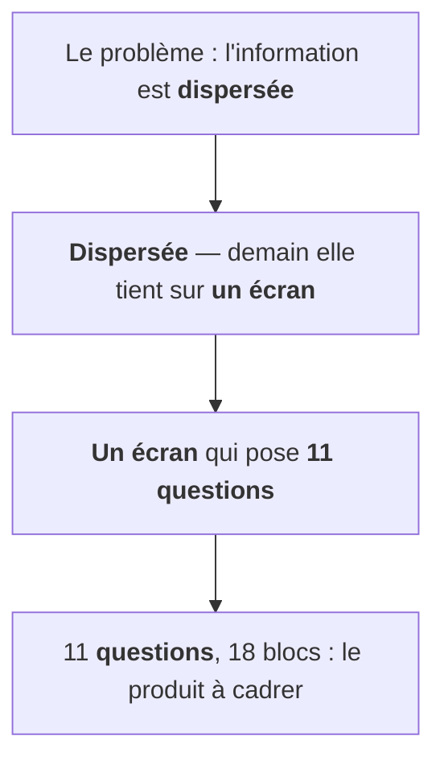

Prenez n'importe quel deck de comité de pilotage et lisez **uniquement les titres**.
Dans la plupart des cas, vous apprendrez de quoi on a parlé — "L'architecture",
"Budget", "Planning", "Risques" — mais rien de ce qui a été **décidé**. C'est la
faiblesse la plus répandue des documents d'entreprise, et elle se corrige avec trois
techniques structurelles, testées sur de vrais decks de cadrage et de COPIL.

## 1. Le titre est une assertion, pas une étiquette

Les cabinets de conseil type McKinsey/BCG inversent la logique : chaque titre est
une phrase complète qui affirme quelque chose. Le corps de la slide ne fait que
prouver le titre.

| Titre-sujet | Titre-conclusion |
|---|---|
| "Équipe" | "Une squad dédiée, un référent métier par chantier" |
| "Planning" | "Cinq itérations verrouillent la mise en production d'octobre" |
| "Risques" | "Le risque résiduel n'est plus technique" |

Deux effets immédiats. **Clarté** : si le titre et le contenu de la slide ne
collent pas, ça se voit — le titre-assertion est un test de cohérence permanent.
**Rétention** : un dirigeant qui feuillette reconstruit tout le raisonnement à
partir des seuls titres. Ce n'est pas du style, c'est le mécanisme qui évite la
mort par PowerPoint.

## 2. Le chaînage : chaque titre reprend la fin du précédent

Une fois les titres transformés en assertions, on peut les **enchaîner** : la fin
d'un titre devient le début du suivant.

Lu d'un trait, l'enchaînement des titres raconte l'arc complet — le corps devient
optionnel. Le raccord de phrases est invisible pour le lecteur pressé, mais il
crée une continuité cognitive : on sait toujours d'où l'on vient et où l'on va.
Testé sur un deck de kickoff de 11 slides, la chaîne a survécu à toutes les
révisions sans se briser — c'est aussi un bon test de structure : si une slide ne
peut pas s'accrocher à la chaîne, elle est probablement au mauvais endroit.

## 3. La capability map : le scope en 2D plutôt qu'en liste

Pour communiquer le périmètre d'un produit, un backlog est illisible — les
interlocuteurs ne retiennent pas une liste. L'alternative : une grille 2D dont les
**colonnes suivent le parcours utilisateur** et les lignes regroupent les blocs
fonctionnels, avec un code couleur d'état.

| | Identifier | Comprendre | Approfondir | Agir |
|---|---|---|---|---|
| **Recherche** | 🟢 construit | 🟢 construit | 🟡 v1 | ⬜ futur |
| **Analyse** | 🟢 construit | 🟡 v1 | 🟡 v1 | ⬜ futur |
| **Restitution** | 🟡 v1 | 🟡 v1 | ⬜ futur | ⬜ futur |

Trois choses qu'une liste ne donne pas : un **récit lisible** (de gauche à droite,
comme l'usage réel), une **honnêteté visuelle** sur le scope (le gris se voit,
pas d'euphémisme possible), et un **test de complétude** — si la colonne de droite
est entièrement grise, la carte vous le dit avant le client.

## Le geste commun

Ces trois techniques font la même chose à des échelles différentes : elles
déplacent le récit **du corps du document vers sa structure**. Le lecteur qui ne
lit que la charpente — titres, enchaînements, grille — repart avec les décisions,
le fil, et le périmètre. Ceux qui lisent le détail y trouvent les preuves.

C'est l'inverse de l'habitude courante, qui soigne le contenu et improvise la
structure. Or en comité, personne ne lit le contenu : tout le monde lit la
structure.
