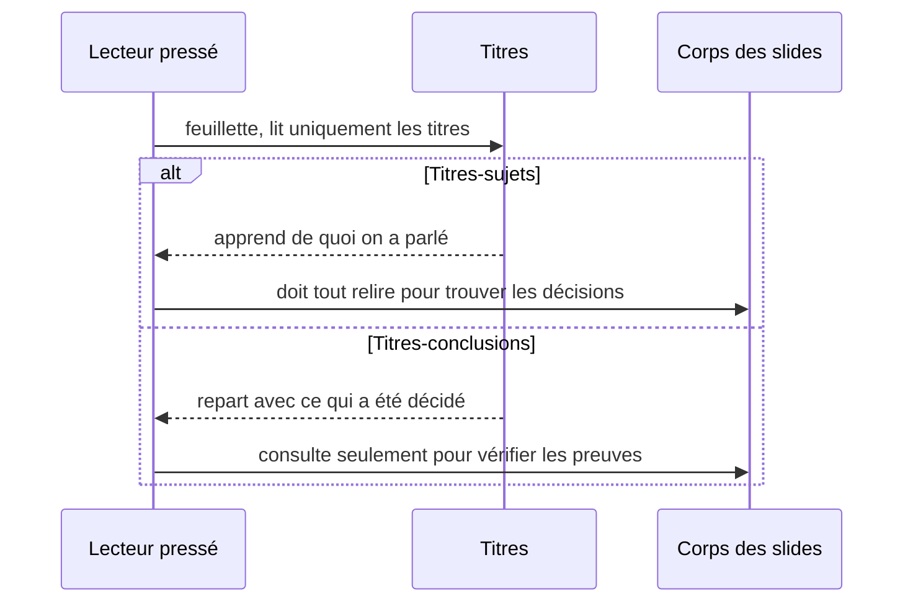
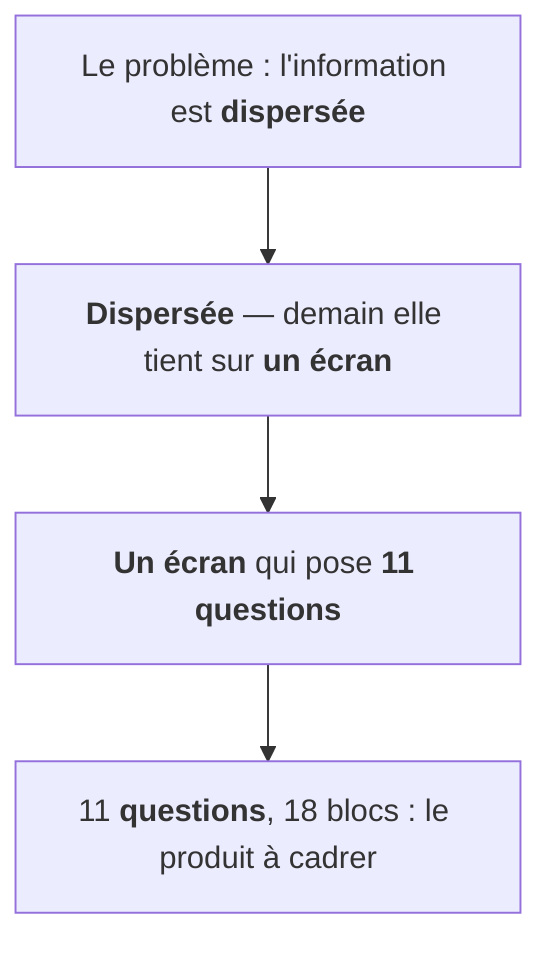
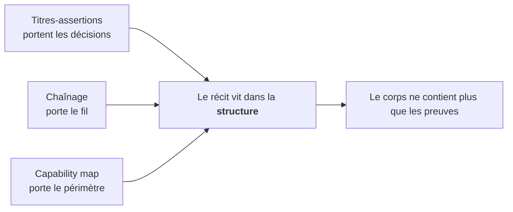

Il existe un test qui ne pardonne pas. Prenez votre dernier deck de COPIL. Cachez le corps des slides. Lisez uniquement les titres.

Si ce que vous lisez ressemble à "Architecture", "Budget", "Planning", "Risques" — vous n'avez pas un deck. Vous avez une table des matières. Vous savez de quoi on a parlé. Vous ne savez rien de ce qui a été **décidé**.

Tout le monde pense que la qualité d'un document se joue dans le contenu. On passe des heures à polir les bullet points, à ajuster les graphiques, à peaufiner l'annexe que personne n'ouvrira. Et on improvise la structure en dix minutes, à la fin. La vérité, c'est que c'est exactement l'inverse qu'il faut faire. Parce qu'en comité, personne ne lit le contenu. Tout le monde lit la structure.

Ce n'est pas une théorie. C'est ce que j'ai testé sur de vrais decks de cadrage et de COPIL. Trois techniques, trois échelles, un seul geste. On les prend une par une.

## Le titre est une assertion, pas une étiquette

Regardez comment lisent les gens à qui vos decks sont destinés. Ils ne lisent pas. Ils feuillettent. Ils scannent les titres, s'arrêtent sur un chiffre, repartent. C'est leur mode de lecture par défaut, et aucun deck ne le changera.

Les cabinets type McKinsey/BCG l'ont compris depuis longtemps, et leur réponse est brutale de simplicité : chaque titre est une **phrase complète qui affirme quelque chose**. Le corps de la slide ne raconte rien. Il prouve le titre. C'est tout.

Concrètement, sur les decks où j'ai appliqué la règle :

| Titre-sujet | Titre-conclusion |
|---|---|
| "Équipe" | "Une squad dédiée, un référent métier par chantier" |
| "Planning" | "Cinq itérations verrouillent la mise en production d'octobre" |
| "Risques" | "Le risque résiduel n'est plus technique" |

Relisez la colonne de droite. Trois titres, et vous connaissez déjà le staffing, la deadline et l'état du risque. Vous n'avez ouvert aucune slide.

Deux effets, et le premier n'est pas celui qu'on croit. Le plus évident, c'est la **rétention** : un dirigeant qui feuillette reconstruit tout le raisonnement à partir des seuls titres. Mais le plus précieux, c'est la **clarté** — pour vous, l'auteur. Un titre-assertion est un test de cohérence permanent. Si le titre affirme "Cinq itérations verrouillent octobre" et que le corps de la slide ne le démontre pas, ça se voit immédiatement. Un titre-sujet, lui, pardonne tout : sous "Planning", vous pouvez mettre n'importe quoi. C'est bien le problème.

Ce n'est pas une question de style. C'est le mécanisme qui évite la mort par PowerPoint.

## Le chaînage : chaque titre reprend la fin du précédent

Transformer les titres en assertions, c'est la moitié du chemin. Vous avez des phrases. Vous n'avez pas encore une histoire.

La deuxième technique : **enchaîner** les titres. La fin d'un titre devient le début du suivant. Voici la chaîne réelle d'un deck de kickoff :

Lisez la chaîne d'un trait, sans rien d'autre. Problème, solution, forme, périmètre. L'arc complet tient dans quatre titres. Le corps des slides devient optionnel — il est là pour ceux qui veulent les preuves, pas pour ceux qui veulent le fil.

Le raccord de phrases est invisible pour le lecteur pressé. Il ne se dit jamais "tiens, ce titre reprend le précédent". Mais il ressent la continuité : il sait toujours d'où il vient et où il va. La navigation devient orientée vers l'avant. On n'erre plus dans le document, on le descend.

Et voici ce qui m'a surpris. Sur ce deck de kickoff de 11 slides, la chaîne a survécu à toutes les révisions sans se briser. Toutes. Ce n'est pas un hasard : le chaînage est aussi un **test de structure**. Une slide qui ne peut pas s'accrocher à la chaîne — dont le sujet ne se raccorde ni à ce qui précède ni à ce qui suit — est probablement au mauvais endroit. Ou n'a rien à faire dans le deck. La contrainte narrative fait le tri à votre place.

## La capability map : le périmètre en 2D, pas en liste

Troisième situation, même maladie. Vous devez communiquer le périmètre d'un produit. Le réflexe : montrer le backlog. Une liste.

Personne ne retient une liste. Vos interlocuteurs hochent la tête pendant la lecture et ont tout oublié en sortant. Pire : une liste ne dit rien de la cohérence. Trente items, est-ce un produit pensé ou un inventaire de fonds de tiroir ? Impossible à dire.

L'alternative que j'ai utilisée : une grille 2D. Les **colonnes suivent le parcours utilisateur**, de gauche à droite, dans l'ordre de l'usage réel. Les lignes regroupent les blocs fonctionnels. Un code couleur donne l'état de chaque case.

| | Identifier | Comprendre | Approfondir | Agir |
|---|---|---|---|---|
| **Recherche** | 🟢 construit | 🟢 construit | 🟡 v1 | ⬜ futur |
| **Analyse** | 🟢 construit | 🟡 v1 | 🟡 v1 | ⬜ futur |
| **Restitution** | 🟡 v1 | 🟡 v1 | ⬜ futur | ⬜ futur |

Cette grille fait trois choses qu'aucune liste ne fera.

Un **récit lisible** : on la parcourt de gauche à droite, comme l'utilisateur parcourt le produit. La structure raconte le workflow sans qu'on ait besoin de l'expliquer.

Une **honnêteté visuelle** : le gris se voit. Impossible d'enterrer le "pas encore fait" au milieu d'une liste, impossible d'euphémiser. Le périmètre réel saute aux yeux — et paradoxalement, c'est ce qui rassure : la grille montre un produit délibérément découpé, pas un produit incomplet.

Un **test de complétude** — pour vous, encore une fois, avant le client : si la colonne de droite est entièrement grise, votre produit identifie et comprend, mais ne permet pas d'agir. La carte vous le dit avant que quelqu'un d'autre ne le remarque en séance.

## Le geste commun

Trois techniques, trois échelles — la slide, le document, le produit. Mais un seul geste, toujours le même :

Déplacer le récit **du corps du document vers sa structure**. Le lecteur qui ne lit que la charpente — titres, enchaînements, grille — repart avec les décisions, le fil et le périmètre. Celui qui lit le détail y trouve les preuves. Les deux lectures sont servies. L'habitude courante ne sert que la seconde — celle que personne ne pratique.

Maintenant, le zoom out. Pourquoi cette inversion est-elle si rare, alors qu'elle est si simple ?

Parce qu'on écrit nos documents comme on les a produits, pas comme ils seront lus. On a passé des semaines dans le détail, alors on présente le détail. La structure, elle, arrive en dernier, quand tout est déjà écrit — au moment précis où l'on n'a plus l'énergie de la penser. C'est une asymétrie fondamentale entre l'auteur et le lecteur : l'auteur vit dans le corps du document, le lecteur vit dans sa structure. Et presque toute la communication d'entreprise est optimisée pour le mauvais des deux.

Il y a une conséquence plus dérangeante. Dans une organisation, les décisions ne circulent pas par les documents complets. Elles circulent par ce qui survit au feuilletage : les titres qu'on retient, la grille qu'on photographie, le fil qu'on est capable de re-raconter en réunion. Si votre récit n'est pas dans la structure, ce n'est pas votre récit qui circule. C'est celui que chaque lecteur pressé aura reconstruit à votre place — et vous n'avez aucun contrôle sur celui-là.

Soigner la structure, ce n'est donc pas de la mise en forme. C'est choisir qui écrit l'histoire : vous, ou vos lecteurs.
